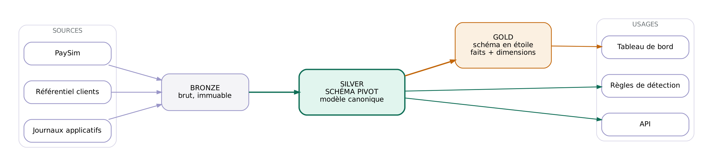
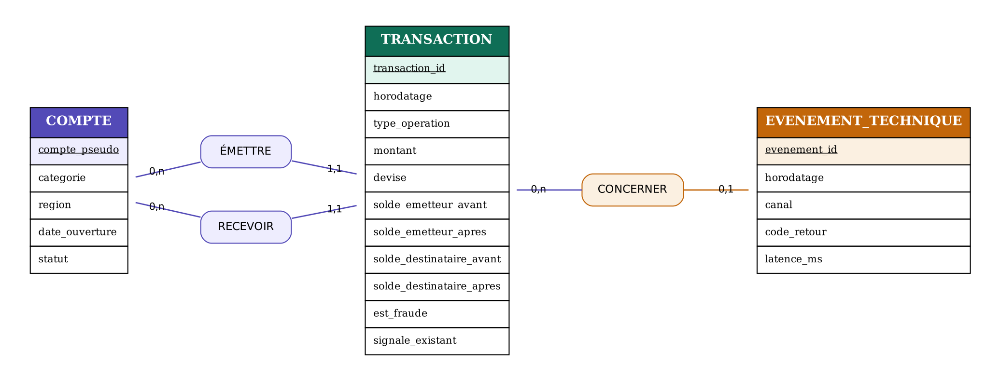

# Schéma pivot — couche silver

**Projet** : Plateforme d'ingestion et de mise à disposition des données de transactions mobile money pour la lutte contre la fraude
**Version** : 1.0 — 8 octobre 2026
**Auteur** : Mariam Douamba
**Statut** : spécification validée, implémentation à venir

---

## 1. Rôle du schéma pivot

Le schéma pivot — aussi appelé **modèle canonique** — est la structure commune vers laquelle toutes les sources convergent et depuis laquelle tous les usages partent.

Sans lui, chaque usage devrait connaître chaque source : trois sources et quatre usages produiraient douze couplages à maintenir. Avec lui, chaque source se traduit une seule fois vers le pivot et chaque usage ne connaît que le pivot : trois traductions plus quatre lectures, soit sept liens. L'écart se creuse à chaque ajout.

Trois propriétés le définissent :

- **Indépendance vis-à-vis des sources.** Aucun nom de colonne, aucun code, aucune convention propre à PaySim n'y subsiste. Une personne lisant le pivot ne doit pas pouvoir deviner de quelle source il provient.
- **Vocabulaire métier.** Les champs portent les noms du domaine — `montant`, `horodatage`, `est_fraude` — et non ceux du fichier d'origine.
- **Granularité stable.** Une ligne de `transaction` est une transaction, quelle que soit la source qui l'a fournie.

### Ce que le pivot n'est pas

Il n'est **pas** la couche de restitution. Les agrégats, les indicateurs et les variables calculées pour la détection vivent en couche **gold**, organisée en **schéma en étoile** (table de faits entourée de dimensions dénormalisées).

La séparation est volontaire : le pivot privilégie la justesse et l'absence de redondance, l'étoile privilégie la vitesse de lecture. Ces deux objectifs sont contradictoires ; les traiter dans deux couches distinctes permet de servir les deux.

---

## 2. Conventions retenues

| Convention | Valeur | Justification |
|---|---|---|
| **Fuseau horaire** | UTC partout | évite les ambiguïtés de changement d'heure et de zone ; l'affichage en heure locale est une question de présentation, pas de stockage |
| **Origine temporelle** | `step = 1` → **1er janvier 2026, 00:00 UTC** | la source ne fournit qu'un pas horaire relatif ; l'origine est arbitraire mais doit être déclarée. La période couverte devient le 1er au 31 janvier 2026 |
| **Devise** | **XOF** (franc CFA BCEAO) | la source ne précise aucune devise. Les ordres de grandeur mesurés sont cohérents avec le franc CFA : une transaction médiane équivaut à environ 114 €. En euro, la même transaction vaudrait plus de 74 000 €, ce qui est incompatible avec l'usage du mobile money |
| **Parité** | 1 EUR = 655,957 XOF, **fixe** | le franc CFA est arrimé à l'euro ; l'affichage en euro reste donc possible par simple division, sans risque de change |
| **Type monétaire** | `DECIMAL(18,2)` | un flottant ne représente pas exactement les décimales ; sur plusieurs millions de transactions financières les erreurs s'accumulent. Le type décimal stocke les chiffres, pas une approximation binaire |
| **Pseudonymisation** | SHA-256 avec sel | déterministe — les jointures restent possibles — et irréversible sans le sel |
| **Nommage** | français, `snake_case` | cohérent avec le reste du projet |

### Sur le type décimal

C'est le point technique le plus important de ce schéma. En couche **bronze**, les montants restent en `double` : c'est ce que la source fournit, et la couche brute ne corrige rien. Le passage en `DECIMAL(18,2)` se fait **en silver**, là où la normalisation des types est le travail attendu.

Illustration du problème : en arithmétique flottante, `0.1 + 0.2` vaut `0.30000000000000004`. Sur un total de plusieurs millions de lignes, l'écart cesse d'être théorique.

### Sur la pseudonymisation

`compte_pseudo = SHA-256(sel || identifiant_source)`

Le sel est stocké dans la variable d'environnement `SEL_PSEUDONYMISATION`, jamais versionnée. Deux conséquences pratiques :

- Le sel doit être **conservé durablement**. Le perdre ou le changer régénère des pseudonymes différents, et l'historique devient incohérent.
- Au sens du RGPD, la pseudonymisation **n'est pas une anonymisation**. Les données restent des données personnelles : le rapprochement avec une personne demeure possible pour qui détient le sel. C'est une mesure de minimisation du risque, pas une sortie du champ réglementaire.

---

## 3. Modèle conceptuel de données (MCD)

### Entités

| Entité | Définition | Alimentée par |
|---|---|---|
| **COMPTE** | Un portefeuille mobile money, client ou marchand | référentiel clients (étape 5), complété par les comptes observés dans les transactions |
| **TRANSACTION** | Une opération financière entre deux comptes | PaySim |
| **EVENEMENT_TECHNIQUE** | Une trace applicative produite lors d'une opération | journaux applicatifs (étape 5) |

### Associations et cardinalités

| Association | Lecture | Cardinalités |
|---|---|---|
| **ÉMETTRE** | Un compte émet des transactions ; une transaction a exactement un émetteur | COMPTE (0,n) — (1,1) TRANSACTION |
| **RECEVOIR** | Un compte reçoit des transactions ; une transaction a exactement un destinataire | COMPTE (0,n) — (1,1) TRANSACTION |
| **CONCERNER** | Une transaction peut avoir plusieurs traces techniques ; une trace concerne au plus une transaction | TRANSACTION (0,n) — (0,1) EVENEMENT_TECHNIQUE |

**Le point à savoir expliquer** : il existe **deux associations distinctes** entre `COMPTE` et `TRANSACTION`. Ce n'est pas une redondance — un compte joue deux rôles différents, émetteur et destinataire, et ces rôles doivent rester distinguables. C'est ce qui produira deux clés étrangères séparées dans le modèle logique.

Le `(0,1)` côté `EVENEMENT_TECHNIQUE` traduit un fait d'exploitation : certaines traces applicatives — une authentification, une consultation de solde — ne se rattachent à aucune transaction.

---

## 4. Modèle logique de données (MLD)

Les cardinalités `(1,1)` et `(0,1)` déterminent où se placent les clés étrangères : du côté de l'entité qui porte la cardinalité maximale à 1.

### Table `transaction`

| Colonne | Type | Contrainte | Commentaire |
|---|---|---|---|
| `transaction_id` | `STRING(64)` | **PK** | empreinte déterministe |
| `horodatage` | `TIMESTAMP` | NOT NULL | UTC |
| `type_operation` | `STRING(16)` | NOT NULL | ∈ {`depot`, `retrait`, `transfert`, `paiement`, `prelevement`} |
| `montant` | `DECIMAL(18,2)` | NOT NULL, ≥ 0 | |
| `devise` | `STRING(3)` | NOT NULL | `XOF` |
| `emetteur_pseudo` | `STRING(64)` | NOT NULL, **FK** → `compte` | association ÉMETTRE |
| `destinataire_pseudo` | `STRING(64)` | NOT NULL, **FK** → `compte` | association RECEVOIR |
| `destinataire_categorie` | `STRING(16)` | NOT NULL | ∈ {`client`, `marchand`} |
| `solde_emetteur_avant` | `DECIMAL(18,2)` | | |
| `solde_emetteur_apres` | `DECIMAL(18,2)` | | |
| `solde_destinataire_avant` | `DECIMAL(18,2)` | **NULL si marchand** | voir § 5 |
| `solde_destinataire_apres` | `DECIMAL(18,2)` | **NULL si marchand** | voir § 5 |
| `est_fraude` | `BOOLEAN` | NOT NULL | vérité terrain |
| `signale_existant` | `BOOLEAN` | NOT NULL | signalement du dispositif historique |
| `_source` | `STRING(32)` | NOT NULL | lignage |
| `_lot` | `STRING(32)` | NOT NULL | lignage |
| `_ingere_le` | `TIMESTAMP` | NOT NULL | lignage — entrée en bronze |
| `_transforme_le` | `TIMESTAMP` | NOT NULL | lignage — passage en silver |

### Table `compte`

| Colonne | Type | Contrainte | Commentaire |
|---|---|---|---|
| `compte_pseudo` | `STRING(64)` | **PK** | empreinte salée |
| `categorie` | `STRING(16)` | NOT NULL | ∈ {`client`, `marchand`} |
| `region` | `STRING(64)` | | référentiel clients |
| `date_ouverture` | `DATE` | | référentiel clients |
| `statut` | `STRING(16)` | | ∈ {`actif`, `suspendu`, `clos`} |
| `_source` `_lot` `_ingere_le` `_transforme_le` | | NOT NULL | lignage |

### Table `evenement_technique`

| Colonne | Type | Contrainte | Commentaire |
|---|---|---|---|
| `evenement_id` | `STRING(64)` | **PK** | |
| `transaction_id` | `STRING(64)` | **FK** → `transaction`, nullable | association CONCERNER |
| `horodatage` | `TIMESTAMP` | NOT NULL | UTC |
| `canal` | `STRING(16)` | | ∈ {`ussd`, `application`, `api`, `agent`} |
| `code_retour` | `STRING(16)` | | |
| `latence_ms` | `INTEGER` | | |
| `_source` `_lot` `_ingere_le` `_transforme_le` | | NOT NULL | lignage |

---

## 5. Règles de transformation — PaySim vers le pivot

| Champ pivot | Source | Règle |
|---|---|---|
| `transaction_id` | calculé | `SHA-256(_source ‖ rang_dans_la_source ‖ nameOrig ‖ nameDest ‖ step ‖ amount)` |
| `horodatage` | `step` | `2026-01-01T00:00:00Z + (step − 1) heures` |
| `type_operation` | `type` | `CASH_IN`→`depot`, `CASH_OUT`→`retrait`, `TRANSFER`→`transfert`, `PAYMENT`→`paiement`, `DEBIT`→`prelevement` |
| `montant` | `amount` | conversion en `DECIMAL(18,2)` |
| `devise` | — | constante `XOF` |
| `emetteur_pseudo` | `nameOrig` | `SHA-256(sel ‖ nameOrig)` |
| `destinataire_pseudo` | `nameDest` | `SHA-256(sel ‖ nameDest)` |
| `destinataire_categorie` | `nameDest` | préfixe `M` → `marchand`, préfixe `C` → `client` |
| `solde_emetteur_avant` | `oldbalanceOrg` | conversion en décimal |
| `solde_emetteur_apres` | `newbalanceOrig` | conversion en décimal |
| `solde_destinataire_avant` | `oldbalanceDest` | **`NULL` si `destinataire_categorie = marchand`**, sinon conversion |
| `solde_destinataire_apres` | `newbalanceDest` | idem |
| `est_fraude` | `isFraud` | `1` → `true` |
| `signale_existant` | `isFlaggedFraud` | `1` → `true` |
| `_transforme_le` | calculé | horodatage UTC de l'exécution |

### Pourquoi un rang dans l'identifiant

PaySim ne fournit aucune clé. Deux transactions peuvent théoriquement présenter des valeurs identiques sur tous leurs champs ; une empreinte du seul contenu produirait alors des doublons. L'ajout du rang d'apparition dans le fichier source garantit l'unicité tout en restant **déterministe** : un rechargement du même fichier régénère exactement les mêmes identifiants. C'est l'idempotence étendue à la couche silver.

### Pourquoi le NULL sur les soldes destinataire

Mesure effectuée sur la couche bronze le 7 octobre 2026 :

- 2 704 388 transactions portent un `oldbalanceDest` à zéro, soit 42,50 %
- **100 %** des 2 151 495 destinataires marchands sont dans ce cas
- 13,13 % des destinataires clients le sont également

Le zéro encode donc deux réalités distinctes : l'absence d'information pour les marchands, et un solde réellement nul pour les clients. La couche silver lève l'ambiguïté en remplaçant l'absence d'information par un `NULL` explicite.

Le périmètre de détection (`transfert` et `retrait`) ne contient **aucun destinataire marchand** : les 389 320 soldes à zéro qui s'y trouvent sont tous de vrais soldes nuls, donc du signal exploitable.

---

## 6. Règles de qualité

| # | Règle | Comportement si violée |
|---|---|---|
| Q1 | `transaction_id` unique | **rejet** — défaut de construction de l'identifiant |
| Q2 | `montant` ≥ 0 | conservation et **marquage** |
| Q3 | `type_operation` dans la liste autorisée | **rejet** vers une zone de quarantaine |
| Q4 | `horodatage` dans la période attendue | **alerte** |
| Q5 | `destinataire_categorie = marchand` ⇒ soldes destinataire à `NULL` | **rejet** — erreur de transformation |
| Q6 | Cohérence `solde_emetteur_avant − montant ≈ solde_emetteur_apres` | **indicateur**, jamais rejet |

### Sur la règle Q2

Seize transactions présentent un montant nul. Elles violent la règle métier « le montant doit être strictement positif » — **et elles sont toutes des fraudes avérées**. Les rejeter supprimerait seize cas de fraude du jeu d'apprentissage.

La règle est donc appliquée en **marquage** et non en rejet. C'est une décision de conception : une anomalie de qualité n'est pas forcément une donnée à écarter, et le choix dépend de l'usage aval.

### Sur la règle Q6

L'écart entre le solde attendu et le solde constaté est précisément l'un des signaux de détection étudiés. Le transformer en critère de rejet reviendrait à supprimer le phénomène qu'on cherche à observer. Il est donc calculé et conservé comme indicateur.

---

## 7. Ce qui sera construit en couche gold

Hors périmètre de ce document, listé pour situer la frontière :

- **Table de faits** `fait_transaction` — grain identique au pivot, enrichie des variables de détection
- **Dimensions** `dim_compte`, `dim_temps`, `dim_type_operation`, `dim_canal` — dénormalisées
- **Agrégats** — volumes et montants par heure, par type, par région ; profils de comportement par compte

---

## 8. Ajouter une source

La procédure, qui est la raison d'être du pivot :

1. Charger la source telle quelle en couche **bronze**, avec ses métadonnées de lignage.
2. Rédiger son descriptif métier et générer son dictionnaire de données.
3. Écrire **une** table de correspondance vers les champs du pivot.
4. Étendre le pivot **uniquement** si la source apporte un concept métier absent — jamais pour accueillir une particularité technique.

Les usages en aval ne sont pas touchés.

---

## 9. Historique

| Version | Date | Évolution |
|---|---|---|
| 1.0 | 8 octobre 2026 | Création — trois entités, conventions UTC / XOF / décimal, règles de transformation PaySim |
